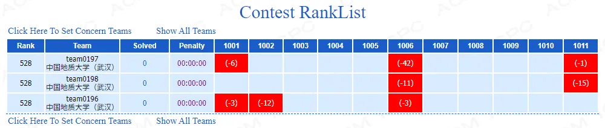

# 2019杭电多校第七场



正如图上显示的一样，三支队全部爆零。我认为这场比赛并不友好。华东师范什么的，听说他们的月赛也是各种爆零场，至少签到题让人好好签个到啊！

接下来是常规的补题部分。

## [HDU 6651 Final Exam](http://acm.hdu.edu.cn/showproblem.php?pid=6651)

题意什么的就直接点标题看原文吧。

> 官方题解：
>
> 换位思考, 考虑如果我们是出题人会怎么让学生做不出$k$题, 即最坏情况．显然, 我们会挑出学生复习得最少的$n−k+1$道题, 让每道题的难度都等于他复习的时间。（田忌赛马的策略）
>
> 因此, 回到学生视角, 我们要让自己复习的最少的$n−k+1$题复习时间总和$>m$, 构造方式显然。

就是“显然”的构造方式也把我们坑了很久，team0197甚至wa了42发。

```cpp
#include <bits/stdc++.h>
using namespace std;
typedef long long ll;
int main()
{
    ll t, n, m, k;
    scanf("%lld", &t);
    while (t--)
    {
        scanf("%lld%lld%lld", &n, &m, &k);
        ll base = (m + 1) / (n - k + 1);
        ll ans = base * (n - k + 1);
        ll r = m + 1 - base * (n - k + 1);
        if (r)
            ans += r + (base + 1) * (k - 1);
        else
            ans += base * (k - 1);
        printf("%lld\n", ans);
    }
    return 0;
}
```

## [HDU 6656 Kejin Player](http://acm.hdu.edu.cn/showproblem.php?pid=6656)

概率递推前缀和一类的东西，lj猜出了公式，我用无穷级数证明了其正确性，然后就在wa和tle中循环。

最后把分数改成了$P*Q^{-1}\bmod{M}$，终于能过了。

> 如果写一个分数类的话可能会因为分子分母不可约导致爆`long long`，题目要输出$P∗Q^{−1} \pmod M$的时候直接每次求个逆元就好。这样算出来的东西甚至可以求前缀和。

$$
\begin{align}
 f\_{x\to x+1}&=\frac{a\_i}{p\_1}+\frac{1-p\_i}{p\_i}(s\_i-s\_{x\_i}) \\\ \\
 s\_{i+1}&=s\_i+f\_{x\to x+1}
\end{align}
$$


```cpp
#define _CRT_SECURE_NO_WARNINGS
#define _SILENCE_CXX17_C_HEADER_DEPRECATION_WARNING
#include <bits/stdc++.h>
using namespace std;
#define CRP(t, x) const t &x
#define OPX(tr, op, t, x) tr operator op(CRP(t, x)) const
#define OPL(t, x) OPX(bool, <, t, x)
#define FIL(x, v) memset(x, v, sizeof(x))
#define CLR(x) FIL(x, 0)
#define NE1(x) FIL(x, -1)
#define INF(x) FIL(x, 0x3f)
#ifndef _DEBUG
#define _DEBUG 0
#endif // !_DEBUG
#define IFD if (_DEBUG)
typedef long long ll, i64;
ll gcd(ll a, ll b) { return b == 0 ? a : gcd(b, a % b); }
const ll mod = 1e9 + 7;
inline ll fpow(ll a, ll b)
{
    ll r = 1;
    for (; b; b >>= 1, a = a * a % mod)
        if (b & 1)
            r = r * a % mod;
    return r;
}
inline ll inv(ll x) { return fpow(x, mod - 2); }
inline char getchar(int)
{
    static char buf[64 << 20], *S = buf, *T = buf;
    if (S == T) T = fread(S = buf, 1, 64 << 20, stdin) + S;
    return S == T ? EOF : *S++;
}
template <typename T>
inline typename enable_if<is_integral<T>::value>::type read(T &x)
{
    int ch = x = 0;
    while (!isdigit(ch)) ch = getchar(0);
    for (; isdigit(ch); ch = getchar(0)) x = x * 10 + ch - '0';
}
const int N = 5e5 + 50;
ll r[N], s[N], x[N], a[N];
struct frac
{
    ll h, l;
    OPX(frac, +, frac, rhs)
    {
        return frac{h * rhs.l + l * rhs.h, l * rhs.l}.reduce();
    }
    OPX(frac, -, frac, rhs)
    {
        return frac{h * rhs.l + l * -rhs.h, l * rhs.l}.reduce();
    }
    OPX(frac, *, frac, rhs)
    {
        return frac{h * rhs.h, l * rhs.l}.reduce();
    }
    OPX(frac, /, frac, rhs)
    {
        return frac{h * rhs.l, l * rhs.h}.reduce();
    }
    frac &reduce()
    {
        if (l == 0) l = 1;
        ll g = gcd(h, l);
        if (g > 1) h /= g, l /= g;
        return *this;
    }
    void print()
    {
        reduce();
        printf("%lld\n", ll(h * inv(l) % mod));
    }
};
ll psum[N];
int main()
{
    int T, n, q;
    read(T);
    while (T--)
    {
        read(n), read(q);
        for (int i = 1; i <= n; i++) read(r[i]), read(s[i]), read(x[i]), read(a[i]);
        /*psum[0] = psum[1] = {0, 1};
        for (int i = 1; i <= n; i++)
            psum[i + 1] = psum[i] +
                          frac{a[i], 1} * frac{s[i], r[i]} +
                          (psum[i] - psum[x[i]]) * frac{s[i] - r[i], r[i]};
        for (int i = 1, l, r; i <= q; i++)
            read(l), read(r), (psum[r] - psum[l]).print();*/
        for (int i = 1; i <= n; i++)
            psum[i + 1] = (psum[i] + (a[i] * s[i] + (s[i] - r[i]) * (psum[i] - psum[x[i]] + mod)) % mod * inv(r[i])) % mod;
        for (int i = 1, l, r; i <= q; i++)
            read(l), read(r), printf("%lld\n", (psum[r] - psum[l] + mod) % mod);
    }
    return 0;
}
```

从代码中可以看出，如果一直无法AC，研究方向就会跑偏，像是这个

```cpp
template <typename T>
inline typename enable_if<is_integral<T>::value>::type read(T &x)
```

就可以保证T一定会是一个整数。

<hr />
> <span id='poem'></span>

<div id="__comment"></div>
<script>$(function(){$.ajax('/api/poem?rnd='+Date.now()+Math.random()).done(function(data){$('#poem').text(data);});});</script>
