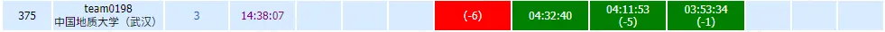

# 2019杭电多校第五场

在第四个小时的时候，我们终于找到了密码条。



## [HDU 6630 permutation 2](http://acm.hdu.edu.cn/showproblem.php?pid=6630)

最后实在是没有办法，于是开始打表找规律。

写了一个应该正确的dfs后将其扔给了红小豆，接着她还真的找到了规律，写了写wa了一发就过了。

```cpp
#define _CRT_SECURE_NO_WARNINGS
#include<iostream>
#include<cstdio>
#include<algorithm>
#include<cmath>
#include<cstring>
#include<cstdlib>
using namespace std;
typedef long long LL;
const LL mod = 998244353;
int t, n;
LL m[100005];

void init()
{
    m[1] = m[2] = m[3] = 1;
    for (int i = 4; i <= 100000; i++)
        m[i] = (m[i - 3] + m[i - 1]) % mod;
}

int main()
{
    int x, y;
    init();
    scanf("%d", &t);
    while (t--) {
        scanf("%d%d%d", &n,&x,&y);
        if (x > y)swap(x, y);
        if (x > 1 && y < n)y = y - x - 1;
        else if (y < n||x>1)y -= x;
        printf("%lld\n", m[y]);
    }
    return 0;
}
```

## [HDU 6629 string matching](http://acm.hdu.edu.cn/showproblem.php?pid=6629)

用hash写T到怀疑人生，最后摸鱼的时候发现是一道exkmp板子题，找了个板子过掉了。

```cpp
#define _CRT_SECURE_NO_WARNINGS
#define _SILENCE_CXX17_C_HEADER_DEPRECATION_WARNING
#include <bits/stdc++.h>
using namespace std;
#define CRP(t, x) const t &x
#define OPL(t, x) bool operator<(CRP(t, x)) const
#define FIL(x, v) memset(x, v, sizeof(x))
#define CLR(x) FIL(x, 0)
#define NE1(x) FIL(x, -1)
#define INF(x) FIL(x, 0x3f)
typedef int64_t ll, i64;
typedef uint64_t ull, u64;
const int N = 1e6 + 50;
int extend[N], nxt[N];
void exkmp(char *s, char *t)
{
    int slen, tlen, a = 0, i, l, p, j;
    slen = strlen(s);
    tlen = strlen(t);
    nxt[0] = tlen; //求next数组
    while (a < tlen - 1 && t[a] == t[a + 1]) a++;
    nxt[1] = a;
    a = 1;
    for (i = 2; i < tlen; i++)
    {
        p = a + nxt[a] - 1;
        l = nxt[i - a];
        if (i + l - 1 >= p)
        {
            j = (p - i + 1) > 0 ? p - i + 1 : 0;
            while (i + j < tlen && t[i + j] == t[j]) j++;
            nxt[i] = j;
            a = i;
        }
        else
            nxt[i] = l;
    } //求extend数组
    a = 0;
    while (a < tlen && a < slen && t[a] == s[a]) a++;
    extend[0] = a;
    a = 0;
    for (i = 1; i < slen; i++)
    {
        p = a + extend[a] - 1;
        l = nxt[i - a];
        if (i + l - 1 >= p)
        {
            j = (p - i + 1) > 0 ? p - i + 1 : 0;
            while (i + j < slen && j < tlen && s[i + j] == t[j]) j++;
            extend[i] = j;
            a = i;
        }
        else
            extend[i] = l;
    }
}
char s[N];
int main()
{
    int T;
    scanf("%d", &T);
    while (T--)
    {
        scanf("%s", s);
        exkmp(s, s);
        int len = strlen(s);
        ll ans = 0;
        for (int i = 1; i < len; i++)
        {
            //printf("%2d%c", extend[i], " \n"[i == len - 1]);
            ans += extend[i] + (i + extend[i] < len);
            //if (i + extend[i] < len) ans++;
        }
        printf("%lld\n", ans);
    }
    return 0;
}
//int main()
//{
//    char s[N];
//    ull hs[N], b[N];
//    for (int i = *b = 1; i < N; i++) b[i] = b[i - 1] * 131;
//    int T;
//    scanf("%d", &T);
//    while (T--)
//    {
//        scanf("%s", s + 1);
//        // int len = strlen(s + 1);
//        // for (int i = 1; i <= len; i++) hs[i] = hs[i - 1] * 131 + s[i];
//        int len = 0;
//        for (char *p = s + 1; *p; len++) hs[len + 1] = hs[len] * 131 + *p++;
//        ull ans = 0;
//        for (int i = 2; i <= len; i++)
//        {
//            int L = i, R = len + 1, M = L;
//            while (L < R - 1)
//            {
//                M = (L + R) >> 1;
//                // ull hs1 = hs[M - i + 1];
//                // ull hs2 = hs[M] - hs[i - 1] * b[M - i + 1];
//                if (hs[M - i + 1] == hs[M] - hs[i - 1] * b[M - i + 1])
//                    L = M;
//                else
//                    R = M;
//            }
//            ans += L - i + 1 + ((L != i || s[1] == s[L]) && L < len);
//        }
//        printf("%llu\n", ans);
//    }
//    return 0;
//}
```

## [HDU 6629 permutation 1](http://acm.hdu.edu.cn/showproblem.php?pid=6628)

permutation 2的暴力起到了重要作用，于是这个题我也打算写一写暴力，观察到$1\le K\le \min(104,N!)$，于是考虑小规模暴力，大规模由于首位一定所以进行有限制暴力。

```cpp
#define _CRT_SECURE_NO_WARNINGS
#define _SILENCE_CXX17_C_HEADER_DEPRECATION_WARNING
#include <bits/stdc++.h>
using namespace std;
#define CRP(t, x) const t &x
#define OPL(t, x) bool operator<(CRP(t, x)) const
#define FIL(x, v) memset(x, v, sizeof(x))
#define CLR(x) FIL(x, 0)
#define NE1(x) FIL(x, -1)
#define INF(x) FIL(x, 0x3f)
typedef long long ll, i64;
int a[1005];
struct MyStruct
{
    int a[21], n;
    OPL(MyStruct, rhs)
    {
        auto b = rhs.a;
        for (int i = 1; i < n; i++)
        {
            if (a[i] - a[i - 1] < b[i] - b[i - 1]) return true;
            if (a[i] - a[i - 1] > b[i] - b[i - 1]) return false;
        }
        return false;
    }
} arr[362881];
int main()
{
    int T, n, k;
    scanf("%d", &T);
    while (T--)
    {
        scanf("%d%d", &n, &k);
        if (n <= 9)
        {
            for (int i = 0; i < n; i++) a[i] = i + 1;
            int cnt = 0;
            do
            {
                memcpy(arr[cnt].a, a, n << 2);
                arr[cnt].n = n;
                cnt++;
                /*for (int i = 0; i < n; i++)
                printf("%2d%c", a[i], " \n"[i == n - 1]);
            printf("  ");
            for (int i = 1; i < n; i++)
                printf("%2d%c", a[i] - a[i - 1], " \n"[i == n - 1]);
            putchar('\n');*/
            } while (next_permutation(a, a + n));
            sort(arr, arr + cnt);
            /*
            for (int i = 0; i < cnt; i++)
            {
                auto a = arr[i].a;
                for (int i = 0; i < n; i++)
                    printf("%2d%c", a[i], " \n"[i == n - 1]);
                printf("  ");
                for (int i = 1; i < n; i++)
                    printf("%2d%c", a[i] - a[i - 1], " \n"[i == n - 1]);
                putchar('\n');
            }*/
            auto a = arr[k - 1].a;
            for (int i = 0; i < n; i++) printf("%d%c", a[i], " \n"[i == n - 1]);
        }
        else
        {
            a[0] = n;
            for (int i = 1; i < n; i++) a[i] = i;
            int cnt = 0;
            do
            {
                //memcpy(arr[cnt].a, a, n << 2);
                //arr[cnt].n = n;
                cnt++;
                if (cnt == k) break;
            } while (next_permutation(a, a + n));
            for (int i = 0; i < n; i++) printf("%d%c", a[i], " \n"[i == n - 1]);
        }
    }
    return 0;
}
```


<hr />
> <span id='poem'></span>

<div id="__comment"></div>
<script>$(function(){$.ajax('/api/poem?rnd='+Date.now()+Math.random()).done(function(data){$('#poem').text(data);});});</script>
