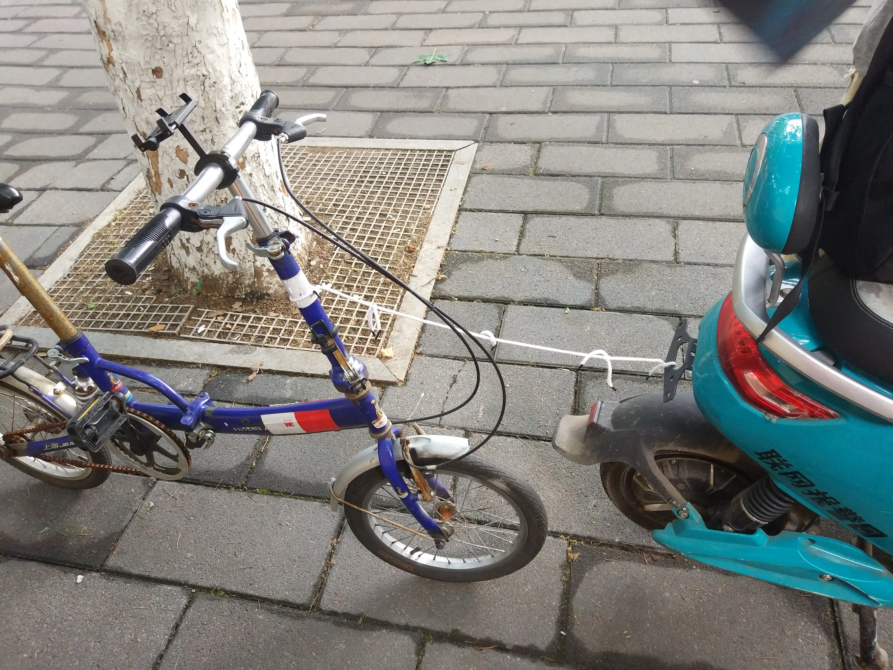
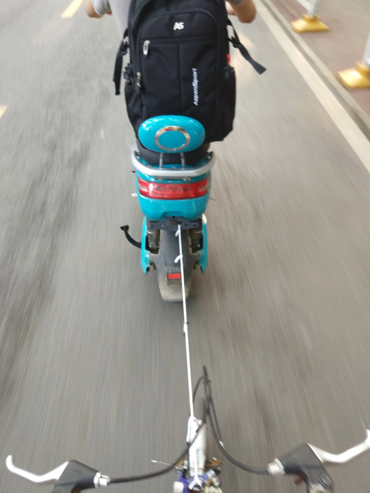
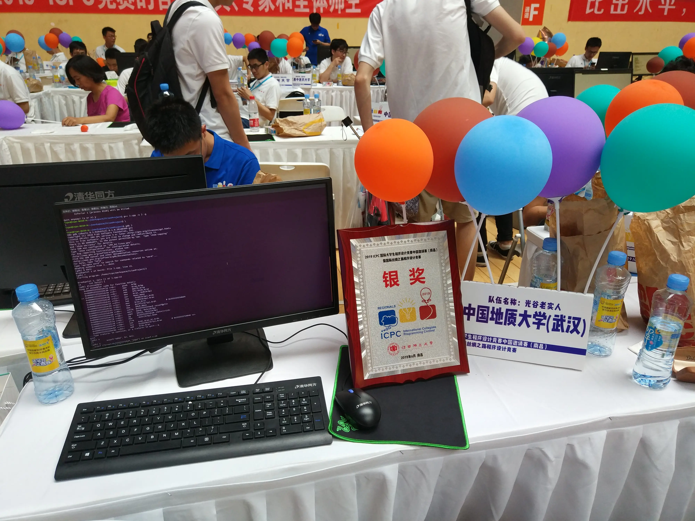

# ICPC南昌邀请赛

## CISCN签到

虽然我在信安大赛线上赛中非常划水，并没有过题，但是还是躺进了分区决赛。

周五下午去签到，返程的时候由于试图跟上电动车，把链条连续蹬掉了两回。

为了能快速回去，我想出了一种方法。

讲真挺好玩的，跑得还快。

回来刚好吃上红小豆的饭。

可爱的红小豆真是棒到不行了。

## ICPC南昌邀请赛

不知道为什么我们就突然进了邀请赛，明明网络赛的名次不高的。

但是既然进了就好好打吧。

周六一大早起来，接上红小豆，捕捉佬蒋，然后在北街口看到了“助理教练”TripleJ，难为他起的那么早。

看看天气预报，感觉应该不用带伞。一出门发现红小豆也是这么想的，于是我俩最后都没带伞。

我们错误的估计了早上的车速，到火车站过于早。

等车时看佬蒋打节奏天国，不知道为什么就是感觉非常生草。

上火车后继续学习打CTF，还碰上了湖工的一个女队，她们坐在前面两排，一看到我就开始膜，我怀疑（CCNU游记中提到的）女装大佬又在她们面前说了我什么奇怪的东西。

下车后转地铁，出了地铁站开始下很小的雨，符合预期，但是没有两分钟就一转大雨，出乎意料。还好佬蒋和TripleJ带了伞，勉强够用。TripleJ把他的破伞借给了我们，保证了我们不会淋得太湿。没走两步红小豆就把伞从我手中抢过去举着，不太明白为什么，由于ACL的问题也没有获得任何详细信息。不过她觉得好就行。

签到成功，忽悠TripleJ穿着教练衣服和我们合影，打车去宾馆，发现还没法入住，只能在大厅凑合着休息一下。午餐和红小豆吃外卖炸鸡，又是因为过于烫而只能看着她吃的一顿饭。不过考虑到她一边吃一边玩手机，我还是吃到了足够的食物——至少够我打下午的热身赛了。

一直到了该去热身赛的时候，雨还是没有小下来，只好冒雨前进，到了体育馆，整条裤子都是湿的，不过大家都没有好到哪去。

### 热身赛

右前方坐着杭电三队，感到了一些威压。

翻开题目，发现第一题是简单的凯撒密码，作为信息安全专业本科生，拿起键盘便开敲，敲到一半发现不对劲，为什么这个题目是中文的？正当我们愣住的时候，红小豆发现签到题：最后一题只要输出即可，于是快速注释一发写了个puts就过了，接着写A，发现怎么也不对（指完全逆序），感到奇怪，加了reverse跟没加一样，最后发现我的reverse是在scanf前写的……深感智障，改完后AC，暂列第11名。

接着写BC，我认为B是简单的，随手一写，测过样例，交上去却RE，发现全场都是红色，感觉是题目问题，于是把电脑扔给佬蒋玩，退居二线开始划水。

最后主办方通知是题目问题，但是他们并不打算现在修，而是放我们去吃饭了……

江西普通大学过于大，走去食堂很费了一些功夫，实际上……那个……伙食并不好，被我和佬蒋认为是大部分无法食用的，毕竟我和佬蒋都是不吃翅尖的人，然而红小豆就非常高兴，因为她把我们一个队的翅尖配额都吃了……实在是太厉害了。

最后我和佬蒋是就着汤把白饭吃掉的。

### 比赛前夜

回到宾馆，我和佬蒋终于有地方住了，~~/\*如果实在没地方住，我就\*/~~，回去后大打东方，差点错过七点比赛，我先连A两道后佬蒋终于解放完他的生产力，把电脑交给佬蒋就去叫红小豆过来一起打，最后剩下两个大模拟不想写了，因为获奖无望。然后把电脑扔给他俩打osu。折腾折腾就十点了，过于的晚而且困。

### 现场赛

终于不下雨了，学长们也都到了。

来的过于早而无法进场，和佬蒋围着体育馆跑了一圈才找到厕所，门上的锁还没了。

体育场顶是半透明的，阳光照下来，使我看不清屏幕。

开始比赛，红小豆再次发现最后是签到，打了个puts过掉。

K题是个排序，好像是佬蒋过的，因为我没有啥印象了。

我翻了翻题目，发现F好像做过，打了个表看了看规律，发现这次还是个简化版，打到一半发现忘写修改了，加个树状数组就1A了。

接着是J题，一开始怎么想都要不TLE要不MLE，最后发现字符串总长有限制，于是一个字符串哈希水过去，又1A了。

G题我觉得是个奇怪的图论，但是佬蒋觉得是乱搞，我就把电脑让给佬蒋乱搞，然后他就1A了，我觉得很强。

剩下三个小时一个题都没做出来，各种被细节问题卡住。

比如数字太多存不下，高斯消元TLE，dijkstraWA个不停之类的。

中途发了我队唯一一个clarification:"When can we get our lunch?"

因为过于的饿，试图给红小豆喂食的时候发现教练在看台上盯着这边，害怕（

午餐上来发现是金拱门，非常好。

被发午餐的志愿者认成老师，或许是因为我把教练的衣服抢来穿了。

看着排名从20掉到封榜前的42，痛失Au。

最后rk51拿了个Ag滚回了武汉。

//好像最后对杭电三队造成了压力？

//恭喜“I want to eat McDonald's”队成功吃到金和金拱门。

//恭喜“求求你让我过个题吧”队获得顽强拼搏奖。

//论取队名的艺术

### 返程

食堂的饭看起来仍然难吃，于是只喝了碗汤就开始返程。

火车上和佬蒋轮流打东方，顺便尝试将红小豆拉入坑。

回来去北街吃完饭后已经没有了热水，于是成为了我们寝室今年第三个洗凉水澡的人和目前唯一一个洗凉水澡没有叫出来的人。

## 一些没人看的废话

我，作为教育水平低下地区的失败者：

&nbsp;

眼界比不上北上广的学生。

价值观落后，思想狭隘，认死理。

别人吃饭一样的事情对我来说，

是完全接触不到的另一个世界。

曾经和我一起玩的也是一群nerd，

没有世俗意义上的“健康爱好”。

国家集训队也只能去个清华北大，

没法去“自由民主的灯塔”“全面发展”。

除了还在与课业什么的作斗争，

跟NEET大概没什么两样。

人生极为单调，

又没有获得哪怕一点成功。

看着其他人什么都会什么都强，

想做的事情都能成功，

自己却是垃圾一个，毫无能力，

羡慕转成嫉妒又转成对自己无能的愤怒。

不管在哪里，

都是团队的负担。

一死了之固然容易，

但是想想死后的麻烦，

还是拉倒吧。

活着没啥盼头，

只是履行责任。

每天都是“我应该做什么”，

但却不是“我想要做什么”。

实力配不上野心，

专业方面打不过清北浙交武大华科，

非专业方面又认知狭隘而暴躁易怒。

共情能力低下，

亲手断掉交流的可能，

还不知道如何修复。

对，我深知自己的菜，而且

这个世界上各种人各种事，

一次次的提醒我这个事实。

我比不上这个比不上那个，

我做不到这个做不到那个。

活是不想活，死又懒得死。

一无所长也一无所获，

没有通路还不见归途。

&nbsp;

所有的矛盾都被刻意避免，

所有的分歧都被刻意忽略，

但是它们仍然存在，

而存在是不可否认的。

&nbsp;

一个弹簧，

被越来越大的力压着，

只会有两种结果：

爆发，

或是坏掉。

&nbsp;

坏掉。

> 

